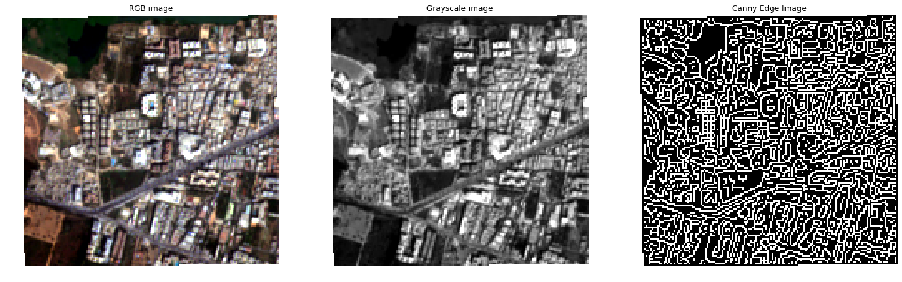
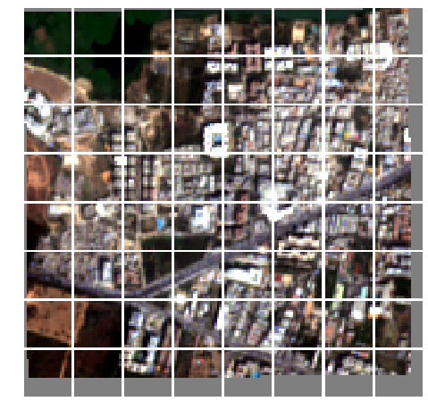
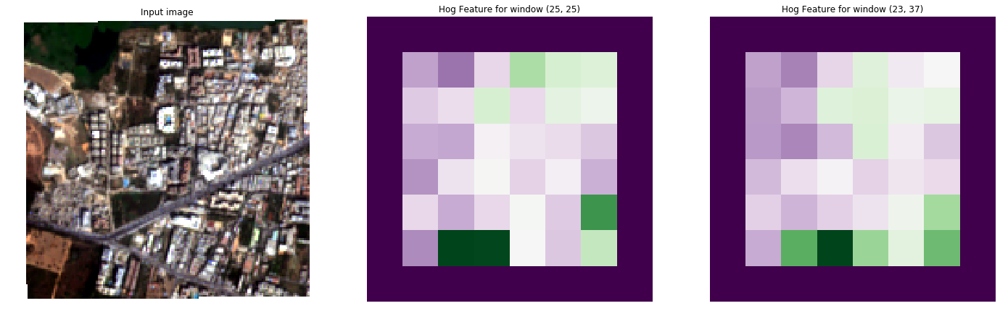
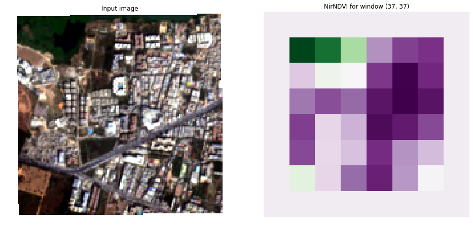
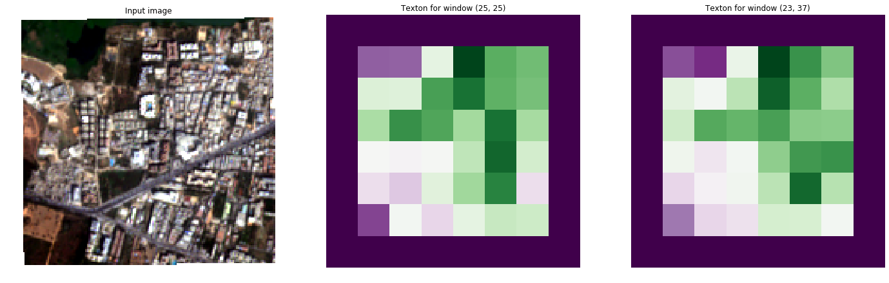

Feature Extraction Example
--------------------------

In this example we will extract the Histogram of Gradients (HoG),
Normalized Difference Vegetation Index (NDVI) and the Pantex features
from a test satelite image.

-  The HoG feature captures the distribution of structure orientations.
-  The NDVI feature captures the level of vegetation.
-  The Pantex feature captures the level of built-up structures.

The image will be split into blocks, in this example 20 by 20 pixels,
and each feature is calculated for this block using a certain amount of
context information called a window. A feature can be calculated on
multiple windows to allow for context at different scales.

In this example
~~~~~~~~~~~~~~~

-  First we will define the Features we would like to extract and with
   which window shapes.
-  We will then load the image using the ``Image`` class.
-  Then we will split the image into blocks using the ``FullGenerator``
   Class.
-  Then we will extract the features using the ``extract_features``
   function.

Live iPython Notebook
^^^^^^^^^^^^^^^^^^^^^

If you are reading this example on readthedocs.io a notebook of this
example is available `in the
repository <https://github.com/DynaSlum/satsense/blob/master/notebooks/FeatureExtraction/feature_extraction.ipynb>`__

.. code:: ipython3

    # General imports
    import numpy as np

    import matplotlib.pyplot as plt
    import matplotlib.gridspec as gridspec
    %matplotlib inline

    # Satsense imports
    from satsense import Image
    from satsense.generators import FullGenerator
    from satsense.extract import extract_features
    from satsense.features import NirNDVI, HistogramOfGradients, Pantex

Define the features to calculate
~~~~~~~~~~~~~~~~~~~~~~~~~~~~~~~~

First we define a list of windows for each of the features to use.

Hog and Pantex will be calculated on 2 windows of 25x25 pixels and 23x27
pixels. NDVI will be calculated on one window with 37x37 pixels.

These window shapes are chose arbitrarily to show the capabilities of
satsense, for your own feature extraction you should think and
experiment with these window shapes to give you the best results.

N.B. The NDVI feature here is called NirNDVI because that implementation
uses the near-infrared band of the image, there are several other
implementations of NDVI available in satsense, see `the
documentation <https://satsense.readthedocs.io/en/latest/api/satsense.features.html>`__

.. code:: ipython3

    # Multiple windows
    two_windows = [(25, 25), (23, 37)]
    # Single window
    one_window = [(37, 37),]
    features = [
        HistogramOfGradients(two_windows),
        NirNDVI(one_window),
        Pantex(two_windows),
    ]

Load the image
~~~~~~~~~~~~~~

Here we load the image and normalize it to values between 0 and 1.
Normalization by default is performed per band using the 2nd and 98th
percentiles.

The image class can provide the individual bands, or a number of useful
derivatives such as the RGB image or Grayscale, we call these base
images. More advanced base images are also available, for instance Canny
Edge

.. code:: ipython3

    image = Image('../../test/data/source/section_2_sentinel.tif',
                    'quickbird')
    image.precompute_normalization()

    fig, (ax1, ax2, ax3) = plt.subplots(1, 3, figsize=(24, 8), sharey=True)

    ax1.axis('off')
    ax1.imshow(image['rgb'])
    ax1.set_title('RGB image')

    ax2.axis('off')
    ax2.imshow(image['grayscale'], cmap="gray")
    ax2.set_title('Grayscale image')

    ax3.axis('off')
    ax3.imshow(image['canny_edge'], cmap="gray")
    ax3.set_title('Canny Edge Image')

    plt.show()

Generator
~~~~~~~~~

Next we create a FullGenerator which creates patches of the image in
steps of 20x20 pixels.

In this cell we also show the images, therefore we load the rgb base
image into the generator. This is only needed here so we can show the
blocks using matplotlib. In the next section we will be using the
``extract_features`` function to extract features, which will be loading
the correct base images for you based on the features that will be
calculated.

The patch sizes are determined by the list of window shapes that you
supply the ``load_image`` function. This is normally also provided by
the ``extract_features`` function.

.. code:: ipython3

    generator = FullGenerator(image, (20, 20))
    print("The generator is {} by {}".format(*generator.shape), " blocks")

    # Create a gridspec to show the images
    gs = gridspec.GridSpec(*generator.shape)
    gs.update(wspace=0.05, hspace=0.05)

    # Load a baseimage into the generator.
    # The window is the same as the block size to show the blocks used
    generator.load_image('rgb', ((20, 20),))

    fig = plt.figure(figsize=(8, 8))
    for i, img in enumerate(generator):
        ax = plt.subplot(gs[i])
        ax.imshow(img.filled(0.5))
        ax.axis('off')

.. parsed-literal::

    The generator is 8 by 8  blocks

Calculate all the features and append them to a vector
~~~~~~~~~~~~~~~~~~~~~~~~~~~~~~~~~~~~~~~~~~~~~~~~~~~~~~

In this cell we use the ``extract_features`` function from satsense to
extract all features.

``extract_features`` returns a python generator that we can loop over.
Each invocation of this generator returns the feature vector for one
feature in the order of the features list. The shape of this vector is
(x, y, w, v) where:

    - x is the number of blocks of the generator in the x direction
    - y is the number of blocks of the generator in the y direction
    - w is the number of windows the feature is calculated on
    - v is the length of the feature per window

We use a little numpy reshaping to merge these feature vectors into a
single feature vector of shape (x, y, n) where n is the total length of
all features over all windows. In this example it will be (8, 8, 13)
because:

    - HoG has 5 numbers per window and 2 windows:   10
    - NirNDVI has 1 number per window and 1 window:  1
    - Pantex has 1 number per window and2 windows:   2
    -                                        Total: 13

.. code:: ipython3

    vector = []
    for feature_vector in extract_features(features, generator):
        # The shape returned is (x, y, w, v)
        # Reshape the resulting vector so it is (x, y, w * v)
        # e.g. flattened along the windows and features
        data = feature_vector.vector.reshape(
                    *feature_vector.vector.shape[0:2], -1)
        vector.append(data)
    # dstack reshapes the vector into and (x, y, n)
    # where n is the total length of all features
    featureset = np.dstack(vector)

    print("Feature set has shape:", featureset.shape)

.. parsed-literal::

    Feature set has shape: (8, 8, 13)

Showing the resulting features
~~~~~~~~~~~~~~~~~~~~~~~~~~~~~~

Below we show the results for the calculated features.

In the result images you can see the edges of the feature vector have
been masked as the windows at the edge of the original image contain
masked values. Furthermore, please keep in mind that the value for the
feature in each block depends on an area around the block.

HoG
^^^

Here is the result of the HoG feature, we display the first value for
each window.

Histogram of Gradients is a feature that first calculates a histogram of
the gradient orientations in the window. Using this histogram 5 values
are calculated. This first value is the 1st heaved central shift moment.
Heaved central shift moments are a measure of spikiness of a histogram.

The other values are: the 2nd heaved central shift moment, the
orientation of the highest and second highest peaks and the sine of the
absolute difference between the highest and second highest peak (this is
1 for right angles).

.. code:: ipython3

    fig, (ax1, ax2, ax3) = plt.subplots(1, 3, figsize=(24, 8))

    ax1.axis('off')
    ax1.imshow(image['rgb'])
    ax1.set_title('Input image')

    ax2.axis('off')
    ax2.imshow(featureset[:, :, 0], cmap="PRGn")
    ax2.set_title('Hog Feature for window {}'.format(two_windows[0]))

    ax3.axis('off')
    ax3.imshow(featureset[:, :, 5], cmap="PRGn")
    ax3.set_title('Hog Feature for window {}'.format(two_windows[1]))

    plt.show()

Normalized Difference Vegetation Index
^^^^^^^^^^^^^^^^^^^^^^^^^^^^^^^^^^^^^^

Here we show the result for the NDVI feature The NDVI feature captures
the level of vegetation, purple means very little vegetation, green
means a lot of vegetation.

.. code:: ipython3

    fig, (ax1, ax2) = plt.subplots(1, 2, figsize=(16, 8))

    ax1.axis('off')
    ax1.imshow(image['rgb'])
    ax1.set_title('Input image')

    ax2.axis('off')
    ax2.imshow(featureset[:, :, 10], cmap="PRGn")
    ax2.set_title('NirNDVI for window {}'.format(one_window[0]))

    plt.show()

Texton
^^^^^^

Here we show the results for the Texton feature. The Pantex feature
captures the level of built-up structures, purple means very little
built-up while green means very built-up.

.. code:: ipython3

    fig, (ax1, ax2, ax3) = plt.subplots(1, 3, figsize=(24, 8))

    ax1.axis('off')
    ax1.imshow(image['rgb'])
    ax1.set_title('Input image')

    ax2.axis('off')
    ax2.imshow(featureset[:, :, 11], cmap="PRGn")
    ax2.set_title('Texton for window {}'.format(two_windows[0]))

    ax3.axis('off')
    ax3.imshow(featureset[:, :, 12], cmap="PRGn")
    ax3.set_title('Texton for window {}'.format(two_windows[1]))

    plt.show()

